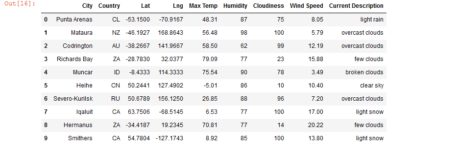
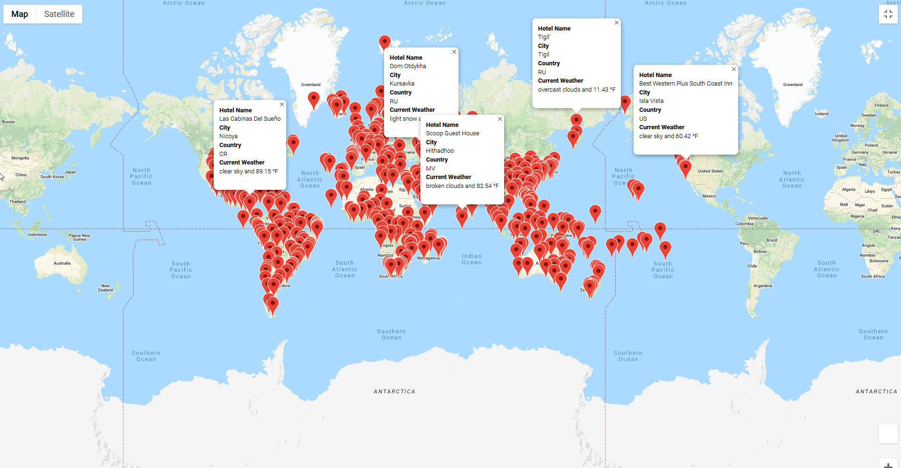
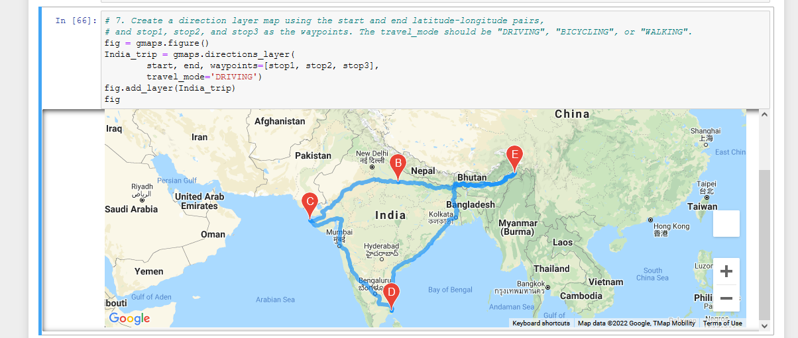
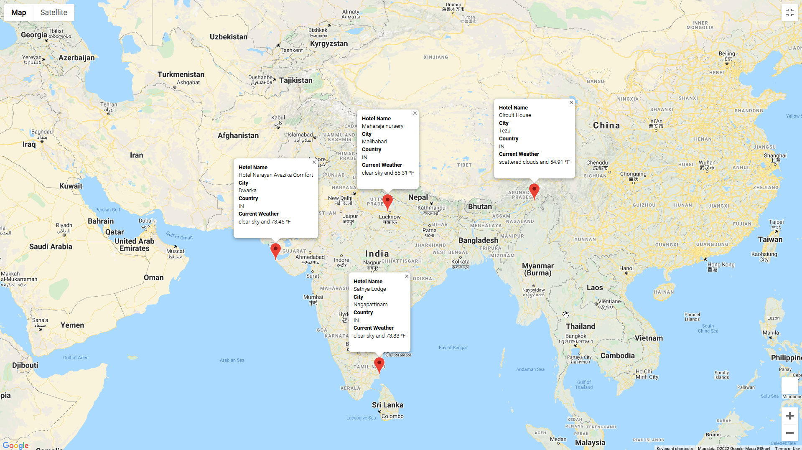

# Module 6 Challenge-

This written analysis contains three sections:

**1. Overview of the analysis**

**2. Results**
 
## 1. Overview of the analysis

The aim of the analysis was to help Jack, the head of intelligence and user-interface at PlanMyTrip to help collect and present the preferred travel destinations for customers based on a specified criteria. The analysis involves looking at over **2,000** latitude and longitudes combinations and pulling information from **OpenWeatherMap** and **Google Maps Directions** API to perfrom exploratory data analysis to provide actionable insights and create travel routes between cities. 

Part of the analysis also involves incorporating feedback from Beta testers and making changes to the app as needed.

## 2. Results

The results primarily highlight the list of challenges that the Beta testers asked for,
### **a. Retrieve Weather Data:**

The aim was to generate a set of 2,000 random latitudes and longitudes, retrieve the nearest city, and perform an API call with the OpenWeatherMap. Then, a new DataFrame containing the updated weather data was created and exported to `WeatherPy_Database.csv`. The structure of the dataframe is as follows: 

*a. Weather Database Summary*

### **b. Create a Customer Travel Destinations Map:**

The aim was to use input statements to retrieve customer weather preferences, then use those preferences to identify potential travel destinations and nearby hotels. Then, those destinations were projected on a marker layer map with pop-up markers.

The final output is as follows:

*b. Vacation Map*

### **c. Create a Travel Itinerary Map:**

The focus was to use the Google Directions API to create a travel itinerary that shows the route between four cities chosen from the customer’s possible travel destinations. A cross country trip of India was chosen for the purpose. Then, a marker layer map with a pop-up marker for each city on the itinerary was created. 

*c. Route Map*

*d. Route Marker Map*

